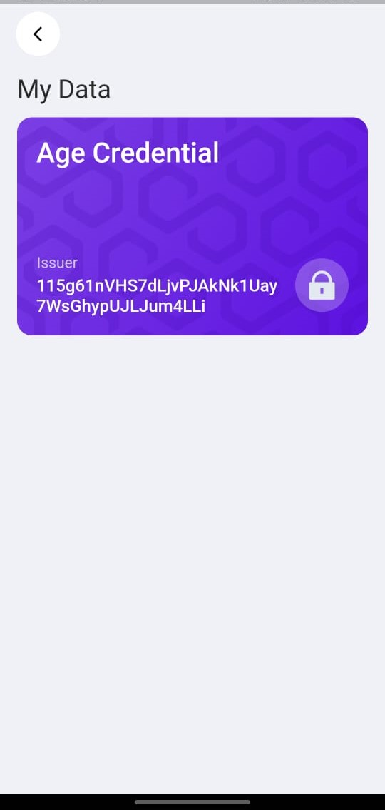
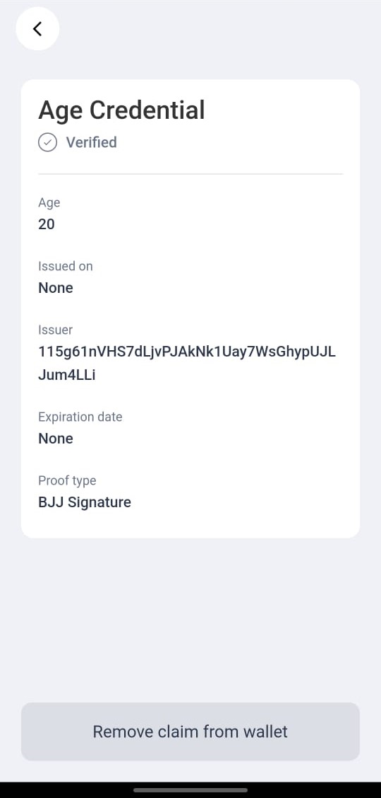
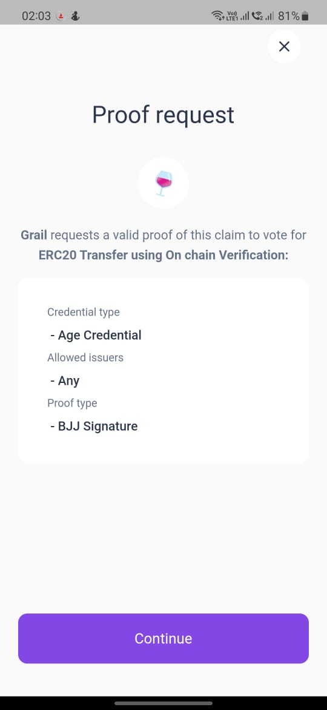
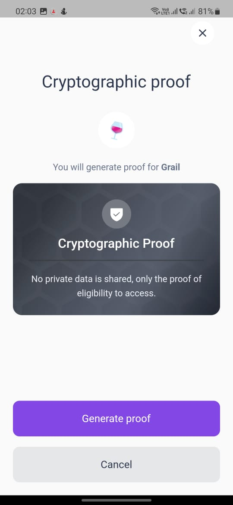
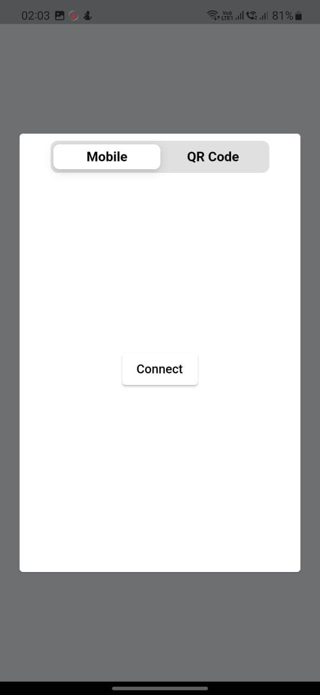
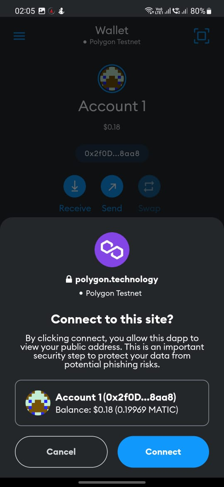
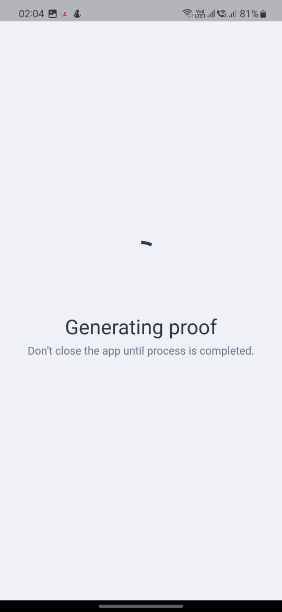
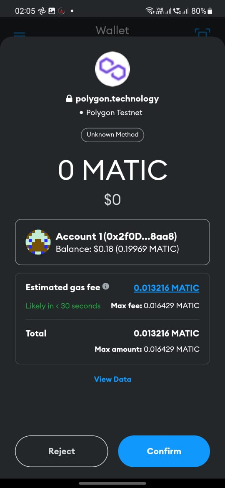
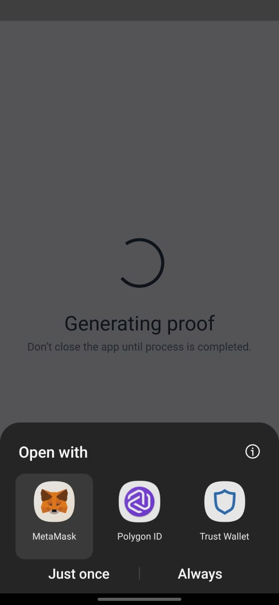
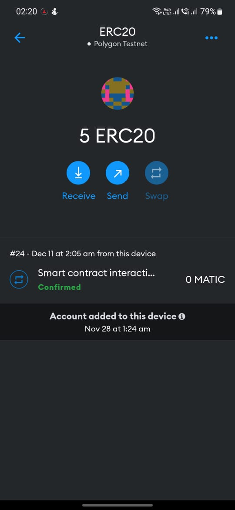

# Implement an ERC20 Transfer On chain Verification with Polygon ID

## Article series to follow on Medium

1. Part-1 : [Polygon-ID Core Concepts](https://medium.com/coinmonks/polygon-id-part-1-introduction-to-core-concepts-394681549f7c)
2. Part-2 : [Creating and Issuance of Claims](https://medium.com/@atharvapaliwal7/polygon-id-part-2-creating-and-issuing-claims-4fda0d992b1d)
3. Part-3 : [On chain verification by Verifier](https://medium.com/@atharvapaliwal7/polygon-id-part-3-on-chain-verification-by-verifier-e68338cd4846)

## Polygon ID Wallet setup

1. Download the Polygon ID mobile app on the [Google Play](https://play.google.com/store/apps/details?id=com.polygonid.wallet) or [Apple app store](https://apps.apple.com/us/app/polygon-id/id1629870183)

2. Open the app and set a pin for security

3. Follow the [Issue a Polygon ID claim](https://platform-test.polygonid.com/sign-in) doc to issue yourself a Credential.

## Instructions to compile and deploy the smart contract

1. Create a .env file in the root of this repo. Copy in .env.sample to add keys
   `touch .env`

2. Install dependencies
   `npm i`

3. Compile smart contracts
   `npx hardhat compile`

4. Deploy smart contracts
   `npx hardhat run --network mumbai scripts/deploy.js`

5. Update the `ERC20VerifierAddress` variable in scripts/set-request.js with your deployed contract address

6. Run set-request to send the zk request to the smart contract
   `npx hardhat run --network mumbai scripts/set-request.js`
   - Successful tx means the age query has been set up: Check on PolygonScan.

## Design Proof Request for Frontend

1. Design a proof request: [Query Based Requests](https://0xpolygonid.github.io/tutorials/wallet/proof-generation/types-of-auth-requests-and-proofs/#query-based-request)

   - Update the `contract_address` field to your deployed contract address

2. Create a frontend with a QR code to the proof request. A user can scan the QR code from the Polygon ID app and trustlessly prove that they are old enough to claim the ERC20 token without revealing their actual date.

## Screenshots / User flow

 

